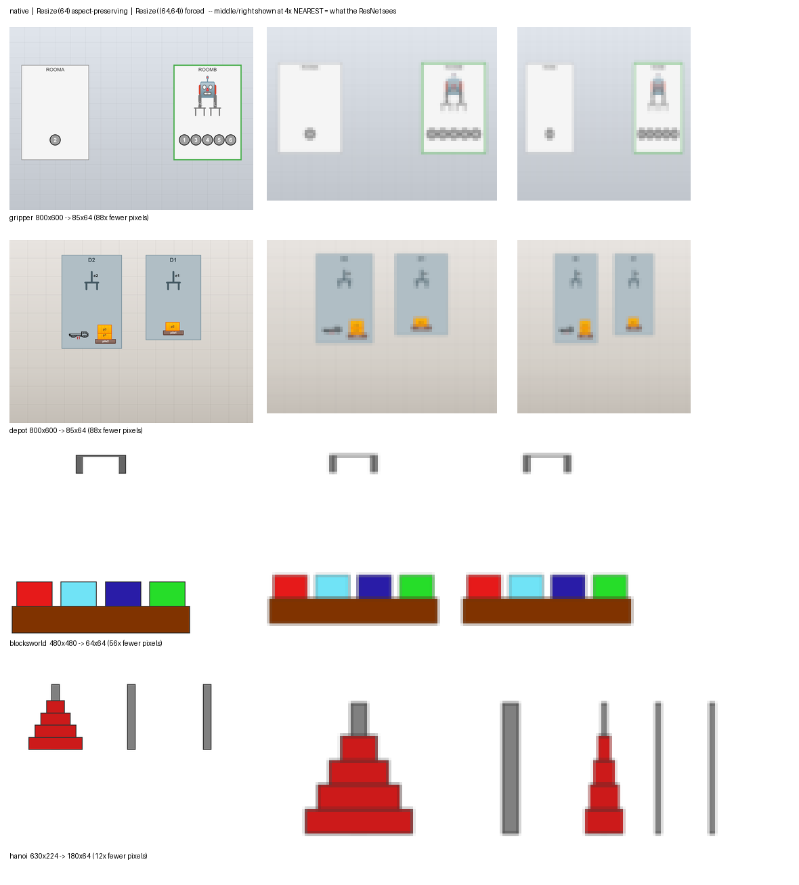
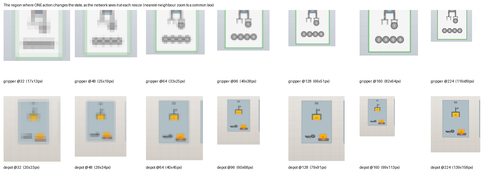

# Algorithm comparison: what each method assumes, and how each one fails

Working analysis of every arm in the benchmark — what it consumes, what it assumes, where its
strength comes from, and the specific ways it breaks. Evidence is from the image experiments
listed in `benchmark/evaluation/cfm/dashboard_config.yaml` unless stated otherwise.

Written to be read before designing an experiment or writing up a comparison table. The
failure-mode section (§3) is the part that matters most: two arms can share a `solving_ratio`
of 0.000 for completely different reasons, and the fix is different in each case.

---

## 1. The arms

| arm | state channel | actions | model search | GT used |
|---|---|---|---|---|
| **CDPS** | VLM-classified PDDL states (masked/noisy) | observed | conflict-directed patch search over trace repairs | init anchored |
| **PISAM_MILP_SR** | same | observed | one CP-SAT projection | init anchored |
| **PISAM_MILP_LOOP** | same | observed | iterative subset-sampled CP-SAT + PI-SAM | `init_only` / `none` |
| **ROSAME** (24, symbolic) | observed PDDL states | observed | gradient descent on relaxed schemas | — |
| **ROSAME-I** (24, imaged) | ResNet-18 over raw frames | observed | gradient descent, `argmax` read-out | init + final (γ anchor, soft) |
| **ROSAME-I_MILP** (ours: 24 net + 26 loop) | same ResNet-18 | observed | CP-SAT projection each epoch | init + final (hard) |
| **ROSAME-I_MILP_26** (planned) | AAE encoder + sigmoid symbol net | observed (adapted) | same loop, upstream-faithful | init + final (hard) |

The single most important axis is **what the state channel can see**. Everything else follows
from it.

## 2. Per-method pros and cons

### CDPS (ours)

**Pros.** Operates on symbolic observations, so any fluent the VLM names is visible to it —
including fluents that are hard to see in pixels. Repairs are explicit and auditable
(`conflict_free_models/`, patch accounting). Degrades gracefully: returns best-so-far on
timeout rather than failing.

**Cons.** Search, so it is budget-bound rather than convergent — on the hanoi image experiment
it hit `terminated_by: timeout_exceeded` in **30/30 cells** at 600 s, finding 1–19 conflict-free
models after 3.7k–14.3k nodes. Reported numbers are therefore a lower bound, and its curve can
*decline* with more trajectories (hanoi solving 0.50 → 0.70 → 0.50 across numtrajs) because the
tree grows against a fixed budget. Model edits being free also invites overfitting to a
conflict-free-but-wrong model (see `conflict-search-free-model-overfitting`).

### PI-SAM + MILP, single round

**Pros.** Fastest arm by a wide margin (0.6–2.8 s/cell on hanoi) and the strongest overall
there: P 0.725 / R 0.994 / solving 0.950. Converges rather than exhausting a budget.

**Cons.** One shot — no opportunity to revise once the projection is made. Inherits whatever
the VLM channel got wrong.

### PI-SAM + MILP, loop

**Pros.** Slightly more robust than SR on noisy sets; stops on `fixpoint` in 29–30/30 cells
rather than on a timeout, so its cost is data-determined, not budget-determined.

**Cons.** More expensive (1.3–61.8 s) for a small quality gain on our domains. The
`gt_anchoring` ablation shows the init anchor buys almost nothing here: `init_only` vs `none`
differ in 14/30 hanoi cells and only in repair cost (83→77, 92→86), not in final metrics
(P 0.723 vs 0.721). Useful as an ablation, weak as a headline.

### ROSAME (24, symbolic)

**Pros.** The apples-to-apples symbolic baseline; no vision confound.

**Cons.** On depot it produced `unsolvable_ratio` 0.433 — over-constrained models that prove
goals unreachable. Reasonable P/R (0.823/0.849) with solving 0.000.

### ROSAME-I (24, imaged)

**Pros.** The published competitor, learning end-to-end from pixels with no symbolic channel at
all. That is a genuinely harder and more ambitious setting than ours.

**Cons.** In our low-data regime it collapses — see §3.1. `solving_ratio` 0.000 in **all five
domains, 150/150 cells**.

### ROSAME-I + MILP (ours)

**Pros.** The MILP rescues the collapse: hanoi P 0.835 / solving 0.850 against its parent's
0.533 / 0.000. Highest precision of any arm on hanoi. Strong evidence that the projection, not
the network, is doing the work.

**Cons.** Still bound by what the pixels contain — see §3.2 (gripper) and §3.3 (depot). It is
also *not* a port of ICAPS-26: it is ICAPS-24's network inside ICAPS-26's MILP loop, and should
be labelled that way.

## 3. Failure modes — the section to read twice

Three distinct mechanisms have produced `solving_ratio = 0.000` in this benchmark. They look
identical in a table and require completely different responses.

### 3.1 Optimisation collapse — "empty effects" (ROSAME-I, no MILP)

**Symptom.** The learned PDDL has `:effect (and )` on most actions. Empty/total: hanoi 4/4,
gripper 3/3, npuzzle 1/1, depot 6/7, blocksworld **3.4/4** — the last corrected from an earlier
"2/4" by the 30-cell census in §5.3, which never once observed a 2/4 blocksworld model. The other
four figures the census could check held at scale; only blocksworld's did not, and it was the one
load-bearing for the hypothesis in item 4 below.

**Metric signature.** Effect *precision* ≈ 1.000 with effect *recall* ≈ 0.000–0.044 — precision
is vacuous when you predict nothing. Precondition recall stays healthy (0.25–0.77).

**Mechanism.** The consistency term `MSE(domain_preds[:-1], preds[1:-1])` is trivially minimised
by `add = del = 0` — identity dynamics — plus a CV head that predicts near-identical vectors for
consecutive frames. That is a genuine optimum, reachable with no learning. Nothing in the loss
pushes effects up, while `lambda_ * MSE(pre, 1)` actively pushes preconditions up. The
asymmetry *is* the precondition/effect split above.

**Why it is a collapse and not a limit.** The information is present; the optimiser found a
degenerate basin. More data, mini-batching instead of one-trace-at-a-time steps, or a bounded
state range would plausibly escape it. This is fixable.

**Candidate contributors, in order of plausibility.** Our port matches ICAPS-24 on the *model* —
same head, same four loss terms, same missing sigmoid, same 4-way argmax read-out — so most of
the gap to the published numbers is in the *regime*. Item 2 is the exception: it was a genuine
algorithmic deviation, and has since been removed.

1. **Data volume.** 3–8 traces (one CV fold) vs upstream's generated corpus at batch 128. The
   degenerate optimum is trivially reachable when almost nothing contradicts it.
2. **Schedule.** ~~`train_per_trajectory=True` trains each trace to convergence in turn.~~
   **FIXED IN CODE — this was never upstream's schedule and is now gone.** Every ROSAME-I row
   currently on disk was trained with it: each trace driven through all its epochs before the
   next trace was touched, i.e. the most forgetting-prone order available. Upstream `main`'s
   `train.py` does the opposite — `DataLoader(trainset, args.batch_size, shuffle=True)`, one
   reshuffled pass over the pooled corpus per epoch. The flag was a local invention that reached
   only the image arm; on the symbolic arm the same-named loop reproduces AMLGym's vendored
   `learn_rosame` and is upstream-faithful, so it stays there. `learn_per_trajectory` and the
   dispatcher argument have been deleted from `algorithm_adapters/rosame_i_runner.py`; the arm
   now trains pooled unconditionally. **Consequence: all 150 stored ROSAME-I rows are stale and
   must be regenerated before any of items 1/3 can be read.**
3. **Epoch semantics.** Upstream: one epoch = a full pass at batch 128. Ours: one optimizer step
   per trace. The number matches; the gradient signal is ~100× smaller.
4. ~~**Aspect-ratio distortion.**~~ **REFUTED — measured, see §5.3.** The hypothesis was that
   `_IMAGE_TF`'s forced-square `Resize((64, 64))` squeezes hanoi **2.81×** and gripper/depot
   **1.33×** horizontally, and that on hanoi this is precisely the axis the fluents live on —
   which peg holds a disc is a left/right position, and disc identity is width. The A/B ran on
   four domains, 30 paired cells each. **Hanoi did not move: 4/4 empty in 30/30 cells under both
   transforms, not one cell different.** Gripper moved slightly the wrong way. The correlation
   this item was built on — least-distorted domain also least collapsed — rested on the "2/4"
   blocksworld figure now corrected to 3.4/4, and does not survive the correction.

   **The transform change stands anyway**, on faithfulness grounds alone: `Resize(64)` is what
   ICAPS-24 does (26-arm plan §4.6.1). It is now known to be causally inert for the collapse,
   which is what makes it safe — it removes a confound from the 24-vs-26 comparison without
   moving the thing being compared. Items 1–3 own the collapse outright.
**Ruled out: augmentation.** ICAPS-24 splits into a `grid_*` family (`CVGrid` over MNIST-composed
cells, with `RearrangeColumn` / `RearrangeBalls` / `RearrangeItems`) and a `synth_*` family
(resnet18 + the head we port, with `Resize(64)` and `RandomHorizontalFlip(0.5)` on blocks only).
We port `synth_*`, and our `_AUGMENT_DOMAINS = {"blocksworld"}` flip matches it exactly — hanoi
and npuzzle correctly get none. **For every domain with a published counterpart, our augmentation
is upstream's augmentation**, so it is not a contributor here.

(4) was held as an aggravator rather than an alternative, on the reasoning that a degenerate
optimum reachable at 85×64 stays reachable at 64×64. The measurement in §5.3 is stronger than
that hedge: at the resolutions tested it is not an aggravator either. The collapse occurs in the
undistorted domains, and undoing the distortion does not lift it in the distorted ones.

**Detection.** Assert the learned model has ≥1 add-or-delete effect across all schemas. One
line, and it would have caught 150 void rows immediately.

### 3.2 Identifiability limit — "static fluent" (ROSAME-I + MILP, gripper)

**First, what this result is and is not.** ICAPS-24 runs gripper only as `grid_gripper`, on a
`CVGrid` network over MNIST-composed cells — there is no `synth_gripper` for the resnet18 head we
port, and none for depot. ICAPS-26 keeps the same shape; its gripper augmentation assumes a 4×6
grid of 16 px cells. So **no published number exists for this architecture on a rendered gripper
scene**, and our gripper row is a new measurement rather than a failure to reproduce one. All five
of our domains are rendered images by design, and that design is not in question here — the point
is only that "ROSAME-I does worse than reported on gripper" is not a sentence anyone can write.
The mechanism below stands on its own evidence regardless.

**Symptom.** `solving_ratio` 0.000 with **`false_plans_ratio` 1.000** — the planner finds a plan
for every test problem and every one fails validation. Nothing unsolvable, nothing timed out.
The model is otherwise excellent: precondition recall **1.000**, effect precision **1.000**.

**The concrete case.** Learned vs GT gripper:

```
GT   pick: … (not (at ?b ?r))  (not (free ?g))   (carry ?b ?g)
ours pick: … (not (at ?b ?r))                    (carry ?b ?g)      ← missing (not (free ?g))

GT   drop: pre (at-robby) (carry)          eff (at ?b ?r) (free ?g) (not (carry ?b ?g))
ours drop: pre (at-robby) (free ?g) (carry) eff (at ?b ?r)          (not (carry ?b ?g))
```

The model **never changes `free`**. One gripper can therefore carry unboundedly many balls;
plans are valid under the model and rejected by VAL every time.

**Mechanism.** The encoder hard-fixes exactly two states — the GT init and the GT final. In
gripper, `free(g)` is **true in both** (the robot starts and ends empty-handed). Consider:

* `M_true` — `pick` deletes `free`, `drop` adds it. `free` is false in the interior.
* `M_static` — neither action touches `free`. `free` is true everywhere.

Both satisfy the hard init. Both satisfy the hard goal. Both are consistent with the observed
action sequence. **They differ only in the interior value of `free`** — which is soft, driven by
the CV head's per-frame probabilities. If the head has no reliable signal for "the gripper is
holding something" (a subtle cue at 64×64), the objective pays nearly the same for both and the
model prior breaks the tie arbitrarily.

**Why it is a limit and not a bug.** No amount of extra training, better optimisation, or a
bigger network fixes it, because **two different action models generate the same observations**.
Escaping it requires new information, not better search:

1. a frame where the fluent is visually unambiguous;
2. traces where the fluent differs at an *anchored* endpoint (not just in the interior);
3. a structural prior preferring models that consume their preconditions.

**Why our arms don't suffer it.** PI-SAM reads `free(g:gripper)` as an explicit predicate from
the VLM classifier (`llm_gripper_fluent_classifier.py:103`) and scores R 1.000 / solving 1.000
on gripper. The information is in the symbolic channel and not in the pixel channel. **This is
a real contribution claim** — a named-predicate observation channel is strictly more
identifiable than a pixel channel for fluents with no visual signature — and it is the cleanest
argument in the benchmark for why our pipeline exists.

**Prediction.** The planned ICAPS-26 arm will *not* fix gripper unless its AAE encoder genuinely
extracts `free` better. If it does fix it, that itself is the interesting result.

### 3.3 Encoding exclusion — constraints that rule out the truth (depot)

**Symptom.** Degraded across the board — depot ROSAME-I_MILP: R_precs 0.760, R_eff_pos 0.550,
and P_eff_pos **0.619** (spurious effects, unlike gripper), `false_plans_ratio` 1.000.

**Mechanism.** `src/milp/vendor/UPSTREAM.md` documents it, naming depot:

> *No redundant adds* (`StepAddPre`) … With observed actions this can make the ground-truth
> model infeasible in domains with legal redundant adds (e.g. depot's `drop` adding
> `(at ?p ?d)` after `lift`, which does not delete it).

**And an asymmetry we must declare.** `ROSAME-I_MILP` runs `MilpEncodingConfig.upstream()`
(`rosame_i_milp_runner.py:88` — `forbid_redundant_adds`, `delete_implies_precondition`,
`schema_nonempty` all ON), while our PI-SAM MILP runs `cdps_dialect()`
(`milp_denoiser/config.py:446` — all OFF). On depot that is exactly the constraint that can
exclude the GT model. Part of the depot gap therefore measures an upstream modelling
assumption, not the algorithms.

**Required before depot goes in a table.** Re-run depot's `ROSAME-I_MILP` with
`MilpEncodingConfig.tag()` (`forbid_redundant_adds=False`) and report how much of the gap
closes. Fidelity to upstream is defensible; an undeclared asymmetry is not.

## 4. Reading the metrics correctly

| pattern | means | look at |
|---|---|---|
| eff-precision ≈ 1, eff-recall ≈ 0 | empty predicted set (§3.1) | the learned PDDL |
| `false_plans` = 1.0, `unsolvable` = 0 | over-permissive model — missing delete or precondition (§3.2) | diff against GT domain |
| `unsolvable` high | over-constrained model | precondition precision |
| all four ratios 0 | **model failed to parse** — `syntax_errors` in `problem_solving`, a field our result schema drops | the model file |
| `learning_time` pinned at the timeout | budget-bound, not converged | `terminated_by` |

The fourth row is worth fixing in the schema: `amlgym.problem_solving` returns a
`syntax_errors` ratio that `evaluate_model` discards, so a model that unified-planning cannot
parse is indistinguishable from one that simply solved nothing.

## 5. Input resolution — a confound we impose on the competitor

`transforms.Resize` is **interpolation, not a crop**: every object stays in frame, nothing is
cut off. But an object can stop being *resolvable*, which is the more insidious failure because
nothing in the pipeline reports it.

Measured across our data (`_IMAGE_TF` targets 64; aspect-preserving `Resize(64)` shown):

| domain | native | after `Resize(64)` | linear | **pixels lost** | identity encoded by | glyph @64 | verdict |
|---|---|---|---|---|---|---|---|
| npuzzle | 187×187 | 64×64 | 2.9× | 8.5× | white digits (22 px native) | **7.5 px** | legible ✅ |
| hanoi | 630×224 | 180×64 | 3.5× | 12× | disc size | — | fine ✅ |
| blocksworld | 480×480 | 64×64 | 7.5× | 56× | colour | — | fine ✅ |
| gripper | 800×600 | 85×64 | 9.4× | **88×** | position (rooms L/R; balls in a row) | — | workable ✅ |
| **depot** | 800×600 | 85×64 | 9.4× | **88×** | **rendered text** (40 px native) | **4.3 px** | **lost ❌** |



*Native (left) vs `Resize(64)` (middle) vs forced `Resize((64,64))` (right). Middle and right are
shown at 4× nearest-neighbour — that is what the ResNet actually receives.*



*The region where a single action changes the state, at each resize. Top: gripper `pick ball1`.
Bottom: depot `unstack c2`.*

**What actually survives.** The pixel count alone is misleading — an 88× reduction sounds fatal
and is not. At shorter-edge 64 the **geometry survives everywhere**: the sweep shows the gripper
arm holding a ball with four balls remaining below it, and depot's crane, lifted crate and truck
all present.

What the resize destroys is **rendered text**, and that matters only where identity is encoded
textually. The question to ask of a domain is therefore *how identity is encoded* — colour, size,
position or text — not how many pixels it lost:

* **npuzzle** — white digits, 22 px native → 7.5 px at 64. Verified legible in the render, and
  the domain scores `solving_ratio` 1.000. Not a problem.
* **gripper** — rooms are distinguished by left/right position and balls by their order in the
  row; both survive the resize. **Resolution therefore does not explain gripper's failure.**
* **depot** — object identity (`D1`/`D2`, crate and pallet labels) exists *only* as rendered text
  at ~40 px native, which becomes **4.3 px** at shorter-edge 64. Legible glyphs need roughly
  8–10 px, i.e. **shorter-edge ≥ 120**, realistically ~224 for comfort.

So the resolution hypothesis is **specific to depot**, not general.

### 5.1 The asymmetry, stated plainly

The VLM classification that feeds CDPS and PI-SAM ran at data-generation time on the **native
800×600** frames. ROSAME-I sees **85×64**. So our pipeline reads `free(g:gripper)` off a
full-resolution image while the competitor has to find it in ~2 px — an information asymmetry in
our favour, imposed by our own preprocessing, on precisely the domains where we win.

Matching upstream's *transform* is not the same as matching upstream's *input*. ICAPS-24's
`Resize(64)` was applied to images rendered to be legible at 64 px; ours are not. Faithfulness to
the number produces an unfaithful comparison.

**This does not touch §3.2.** Gripper's identity is positional and positions survive at 64, so
the resize does *not* explain its `free` failure — the anchored-endpoint identifiability argument
in §3.2 remains the best explanation, and the legibility sweep is the evidence for that rather
than against it.

**Depot is different, and arguably not unfairness at all.** Our VLM reads text; a from-scratch
ResNet at any practical resolution cannot read a 4-pixel glyph. That is a real capability
difference between a pretrained multimodal model and a small CNN trained on 3–8 traces, not a
preprocessing artifact we introduced. It is a legitimate point in our favour and it is *stronger*
stated plainly than hidden behind a resize choice.

**Recommended handling.** Keep 64 for npuzzle, hanoi, blocksworld and gripper — it matches
upstream and loses nothing that matters. For **depot, run both 64 and 224** as a two-row
ablation. That converts a confound into a measured result — "depot at upstream's resolution vs.
depot at a resolution where labels are legible" — which is far more useful than picking one and
defending it.

**Optional confirmation.** Running our own fluent classifier on the resized frames would settle
it empirically per domain. It requires an API key and real spend (~40 image calls for a
5-size × 4-domain sweep); depot at 64/96/128/160/224 is the only slice likely to change a
decision.

### 5.2 Why this also bounds how large a problem the pixel approach can take

The figure suggests a scaling limit that is easy to miss. Every object must remain legible at the
network's input resolution, so the number of objects a domain can depict is bounded by the image
budget — a fourth peg in hanoi, or a sixth ball in gripper, competes for the same pixels. That is
consistent with the small object counts in the upstream domains, and it is a property of the
*approach*, not of any particular implementation: raising the object count forces either a larger
image (and a larger, slower encoder — see §6) or smaller, less resolvable objects.

Our pipeline does not have this coupling: object count changes the predicate vocabulary, not the
image budget.

### 5.3 The resize A/B — result: the distortion is not the cause

Run on four domains, 30 paired cells each (5 folds × 6 trajectory counts), same fold data, same
seeds, arms distinguished only by the transform: control `Resize((64, 64))` (forced square, the
old `_IMAGE_TF`) against treatment `Resize(64)` (shorter edge, aspect preserved, ICAPS-24's form).
Empty-effect counts read directly out of the learned PDDL, with `learned_domain_CDPS.pddl` and
`domain_reference.pddl` from the same cells as positive controls for the counter.

| domain | native | control → treatment | control empty | treatment empty | cells moved |
|---|---|---|---|---|---|
| blocksworld | 480×480 | 64×64 → 64×64 *(same op)* | 103/120 | 103/120 | **0** |
| **hanoi** | 630×224 | 64×64 → **180×64** | 120/120 | 120/120 | **0** |
| gripper | 800×600 | 64×64 → 85×64 | 88/90 | 90/90 | 2, both worse |
| depot | 800×600 | 64×64 → 85×64 | 178/210 | 176/210 | 7 (5 better, 2 worse) |

**Blocksworld is a null control, not a test.** At 480×480 the two transforms are the *same
operation*, so it could not move. It came out exactly null — 0/30 cells, every metric delta
identically 0.000 — which is the evidence that the harness is deterministic and the pairing is
sound. The original prediction "hanoi improves, blocksworld does not" was therefore only ever
one-armed; the blocksworld half was vacuous.

**Hanoi is the test, and it is flat.** The most distorted domain, on the axis its fluents live on,
2.81× — and 4/4 empty in 30/30 cells under both transforms, not one cell different, effect recall
0.000 → 0.000 in every cell. Preconditions moved +0.006 recall in 3 cells. Nothing here is a small
effect that more cells would resolve; it is no effect.

**Gripper moved backwards** — the two cells that had one non-empty schema lost it (28 → 30
all-empty cells). Consistent with §5.1: gripper identity is positional and positions survive at
64 either way.

**Depot's movement is noise.** 5 cells better, 2 worse — a two-sided sign test at p ≈ 0.45. It is
also *not* the depot test: §5.1 argues depot needs shorter edge ≥ 120, and this A/B is 64 against
64. The depot resolution question (item 3 of §7) remains open and untouched by this.

**Ignore the wall-clock column.** It shows depot and gripper 2.2× *faster* under treatment, 30/30
cells, while receiving 1.33× *more* pixels — backwards. The run windows overlap across domains
(control 11:46–13:29, treatment 12:00–14:16 on one box), so several domains trained concurrently
and `learning_time_seconds` is measuring contention. Only hanoi moves in the physically expected
direction (2.81× pixels, +34 s), and it is confounded the same way. Nothing about throughput can
be concluded from this run.

**Consequence.** §3.1 item 4 is refuted; items 1–3 (data volume, schedule, epoch semantics) own
the collapse. The transform change is kept as a faithfulness fix, and its measured inertness is
what makes it safe to keep — it de-confounds the 24-vs-26 comparison without moving the quantity
being compared. Refuting one of four candidates promotes the other three **equally** — this
result does not name a winner among them.

Item 2 has since been closed, and not as an experiment. The per-trajectory schedule turned out to
have no upstream counterpart on the image arm at all, so it was deleted rather than measured
(§3.1 item 2). That does not settle whether the schedule *caused* the collapse — it removes the
deviation, and the re-run tells us what the faithful arm actually scores. Items 1 and 3 can only
be read against that re-run, since every ROSAME-I row now on disk predates the fix. The
5000-epoch cells are a *26-arm budget* control (plan §9.7) and are not a test of any of this;
`5000` is the 26 code default, not a number the 24 arm, which runs the paper's own 70 / 100 /
300, has any use for.

## 6. Where the perception cost is paid — the structural difference

This is the cleanest architectural distinction between the two families, and it is independent of
any measured result.

**ROSAME resolves perception *inside* the learning loop.** The CV encoder's input dimensions are
fixed when the net is built, and the symbol net's output width equals the number of grounded
propositions — which depends on the object universe, and therefore must be frozen before training
starts. (Our `ground_union` exists for exactly this reason: the grounding has to be stable across
every trace in a fold.) Consequences:

* **Bigger images ⇒ bigger encoder feature maps ⇒ more compute per epoch**, paid on every one of
  the 5000 epochs, not once.
* **More objects ⇒ wider symbol net and more schema parameters**, again fixed at build time.
* Setup complexity is therefore determined *mid-process*: the architecture must be sized for the
  perception problem before the learning problem is known to be solvable.

**Our pipeline resolves perception *before* learning.** The VLM/geometric classifier converts each
frame to a predicate set once, pre-learning; the learner then operates on symbols and never sees a
pixel. Consequences:

* Perception is paid **once per frame**, not once per frame per epoch.
* **Image resolution is fully decoupled from model capacity** — an 800×600 frame costs the learner
  nothing, which is precisely why we can afford the native resolution that §5.1 shows ROSAME-I
  cannot.
* Adding objects changes the predicate count but no network architecture.

**The honest flip side**, which belongs in the same paragraph whenever this argument is made: our
approach *requires the predicate vocabulary up front*, and any classifier error is baked in before
learning begins — the learner has no way to revisit the pixels and revise a misread fluent. ROSAME's
end-to-end coupling is a cost, but it is also a capability: in principle it can learn perceptual
features tuned to the dynamics, which a fixed pre-pass cannot. The fair claim is about *cost
structure and scaling*, not about one approach dominating the other.

## 7. Open items

**DONE: `Resize(64)` is in.** The int / aspect-preserving ICAPS-24 form is now the default for
both pixel arms, per-domain configurable, and off-default values suffix the row name
(`benchmark/baselines/rosame_i_runner.py`). §5.3 measured what it did to the collapse: **nothing**.
It is retained as a faithfulness fix, and its inertness is the reason it is safe to retain.

**DONE and refuted: the resize A/B** (was item 2 here) — §5.3. It also came out one-armed:
blocksworld at 480×480 takes the *same* operation under both transforms, so its half of the
prediction was vacuous, and hanoi — the only real test — did not move in a single cell of 30.

1. **Re-run both pixel arms.** Was scoped as bookkeeping — §5.3 puts the resize effect at ~0, so
   the label was the only thing wrong with the stored rows: they carry no recorded `resize` and
   sit under a bare `ROSAME-I_MILP` name, which under the new default means forced-square results
   wearing the aspect-preserving arm's label. **Item 2 has since promoted this to mandatory**:
   those rows also ran the deleted per-trajectory schedule, which is a substantive difference,
   not a cosmetic one. Re-run with `--force`. It is no longer demotable.
2. ~~**Flip `train_per_trajectory` to `False`.**~~ **DONE — and not as an A/B.** The flag had no
   upstream counterpart on the image arm (upstream `main`/`train.py` pools and shuffles), so the
   per-trajectory branch was **deleted** rather than measured: there is one loop now, and it is
   `learn_pooled`. Suite: 412 passed, unchanged. See §3.1 item 2.

   Deleting rather than A/B-ing also dissolves the labelling problem this item used to carry:
   `train_per_trajectory` never reached `row_name`, so an A/B would have averaged both schedules
   under one `ROSAME-I` row. With one schedule there is nothing to disambiguate. Rows written
   from now on carry `"schedule": "pooled"` in `algorithm_specific`; the 150 rows on disk carry
   `"train_per_trajectory": true` and are stale.

   **What is now blocking, and it is item 1's problem too:** every stored ROSAME-I and
   ROSAME-I_MILP row predates the fix, so the re-run is no longer optional bookkeeping. Run it at
   the paper's own epoch counts (70 / 100 / 300, `baselines/rosame_i_runner.py:37-41`), and note
   that this does **not** by itself decide whether the schedule caused the collapse — items 1 and
   3 stay open and must be read against the re-run's numbers, not the current ones.

   *The 5000-epoch cells are not this experiment.* `5000` is the ICAPS-**26** code default, kept
   in plan §9.7 to check that the 600 s-calibrated budget does not silently underperform it. On
   the 24 arm the number is off-paper on both papers and answers no question we have. `epochs`
   still does not reach `row_name`, so if an epoch sweep ever happens it needs the suffix first.
   Prefer the near-free prior check: the adapter returns only a final `_total_loss`, never a
   curve, so one cell with per-epoch loss logged decides whether a sweep is worth scoping at all.
3. **Depot at two resolutions (64 and 224)** — §5.1. Untouched by §5.3, which compared 64 against
   64 and so could not speak to depot's ≥120 legibility threshold. Converts the one real
   resolution confound into a measured row instead of an argument. Now expressible without a name
   collision. Use a per-run `--resize 224` override rather than a `_RESIZE["depot"]` table entry:
   a table entry would make 224 depot's *default* and invert which row carries the suffix. The
   `ROSAME-I__res=224` / `ROSAME-I_MILP__res=224` dashboard keys are already registered, so the
   series will render on its first run.
4. **Depot ablation with `forbid_redundant_adds=False`** (§3.3). Depot has *two* candidate
   explanations — text-label resolution and the encoding constraint — so run both ablations
   before attributing its gap to either. **Caveat for the 26 arm specifically:** upstream's
   `extract_sol_model` labels the four classes with precedence `add > del > pre > none`, so an
   atom that is both a precondition and an add-effect is recorded as `add` and its precondition is
   silently dropped. That case is unreachable while `forbid_redundant_adds` is on — and becomes
   reachable exactly when this ablation turns it off. Read the pseudo-labels, not just the final
   model, when interpreting that run.
5. Is CDPS timeout-limited or capability-limited? One cell at a much larger budget answers it.
6. Surface `syntax_errors` in `result_schema.py`.
7. Add the degenerate-model guard (§3.1) to every learner's output path, not just ROSAME-I's.
